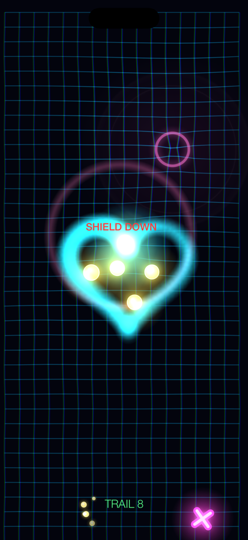
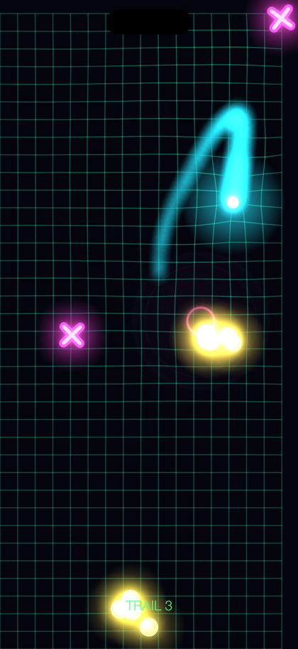
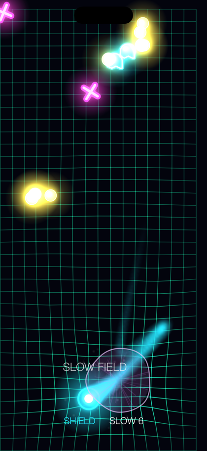
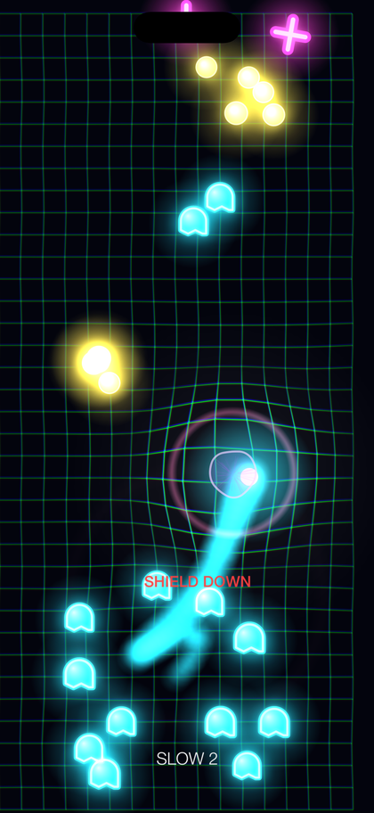
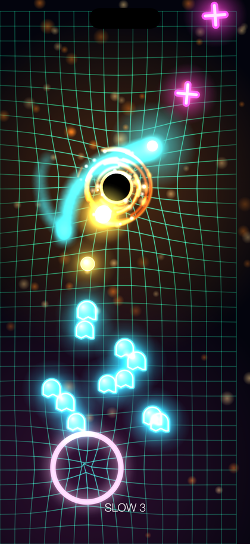
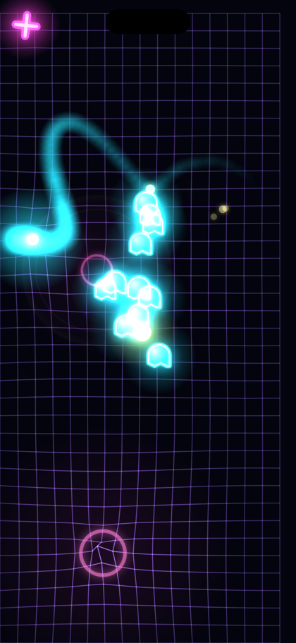
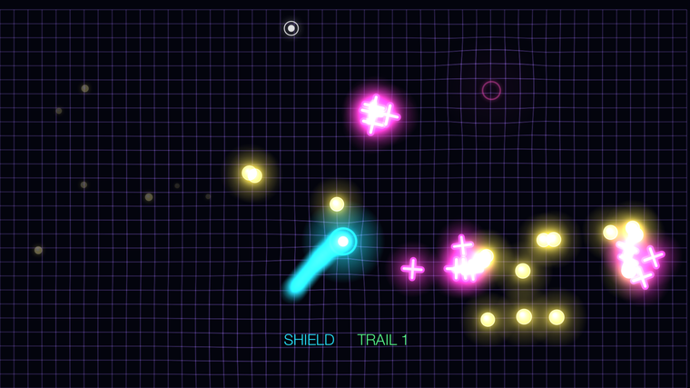
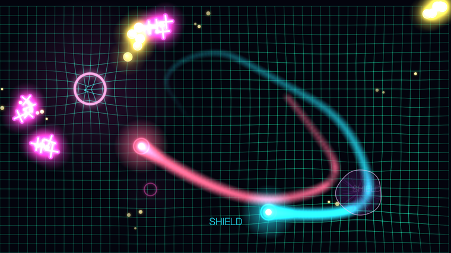
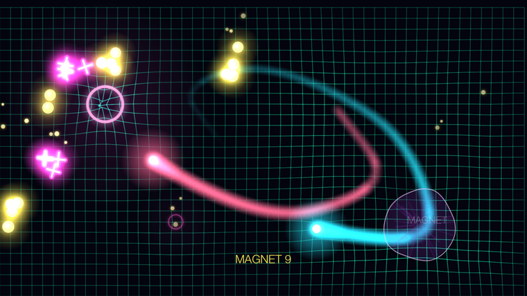

  

<h1 align="center">Neon Snare</h1>

  A minimalist neon arcade game for iPhone and Apple TV. 
  <a href="#report-a-bug">Report a bug</a> ·
  <a href="PRIVACY.md">Privacy</a> ·
  <a href="SUPPORT.md">Support</a>

---

You are a glowing wisp on a dark, elastic energy grid. **You cannot shoot.**

Your weapons are the trail you leave behind and the breathing rings scattered
across the arena. Close a loop with your trail and everything caught inside is
snared. Dive into a ring at the peak of its breath and it detonates — the wider
it has expanded, the bigger the blast. Panic in early and you get a small one.

Simple to start. The ceiling is timing.

## Screens

| | |
|:--:|:--:|
|  **Loop your trail** — everything inside is snared |  **Ride the rings** — hit the peak for a perfect blast |
|  **Survive the surge** — they close in from every side |  **Power-ups and zones** — the rules twist as you climb |
|  **Black holes** — they drag the grid and your aim with it |  **One game, two screens** |

### On Apple TV

   
  <em>The same game, on the big screen</em>

  
   
  <em>Two players: co-op with a shared score, or a duel where the last score wins</em>

## Your iPhone is the controller

No gamepad? The phone in your pocket is one. Open Neon Snare on iPhone, pick
your Apple TV, and the whole screen becomes a trackpad. Two phones make it two
players.

This works over your **local network only** — the phone talks to the Apple TV
directly and nothing leaves your home. See [PRIVACY.md](PRIVACY.md) and
[PRIVACY-APPLE-TV.md](PRIVACY-APPLE-TV.md).

## Privacy

**Neon Snare collects no data. None.** No analytics, no tracking, no ads, no
accounts, no third-party SDKs. Scores and settings stay on your device.

The full policy is in [PRIVACY.md](PRIVACY.md) for iPhone and iPad, and
[PRIVACY-APPLE-TV.md](PRIVACY-APPLE-TV.md) for Apple TV. They differ only in
describing the two ends of the controller feature.

## Report a bug

Bugs and ideas are welcome in the [issue tracker](../../issues/new/choose).

Please include your device and iOS/tvOS version — most reports come down to a
device-specific detail, and it saves a round trip.

## About this repository

This repo is for the issue tracker, the privacy policies and these screens.
The game's source is not published here.
